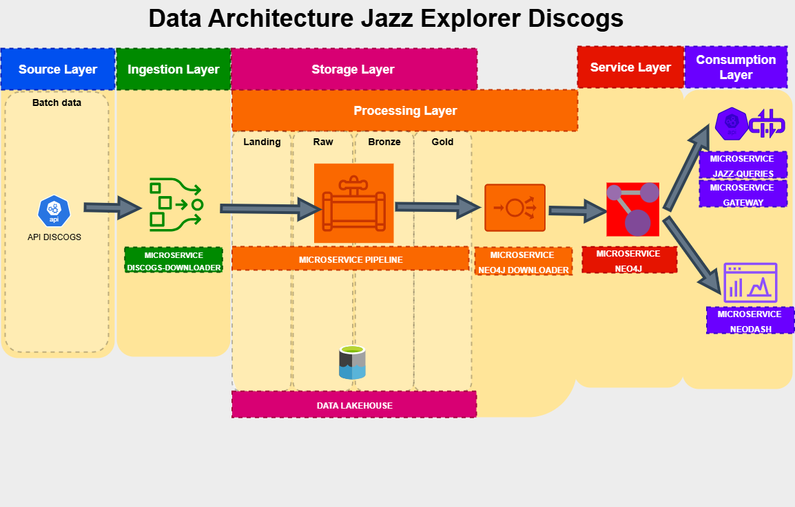
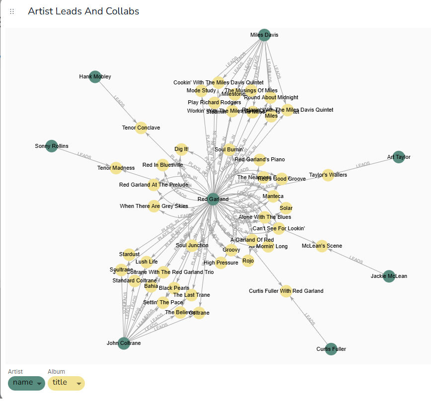
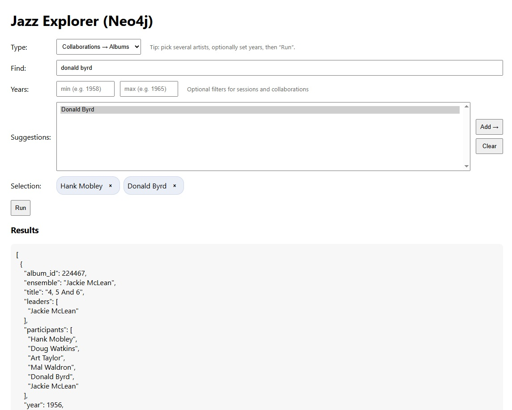

# TheJazzGraph

*(Repository: `TFM-DiscogsApp-v2` – Final Master's Project)*

**TheJazzGraph** is a data engineering project based on microservices that extracts jazz album metadata from the Discogs API, processes it with Spark & Delta Lake, 
and builds a graph database in Neo4j for exploration and visualization.

The goal is to provide an open dataset of jazz albums, musicians, songs, and labels for a time period defined by the user, 
with tools to query and visualize musical connections. The results in this document are based on the 1953–1967 period. 

At its current stage, the project runs locally and exposes a REST API designed to query and analyze relationships between artists, albums, labels and works.

A web application is currently under development to bring this graph exploration experience to a user-facing interface.

## 1. Architecture and Microservices

The project follows a layered architecture. Each microservice has a clear role in the data flow:

- **Source Layer**  
  - **Discogs API**: external source of jazz album data.

- **Ingestion Layer**  
  - **discogs-downloader**: downloads raw data from Discogs API and saves it in the *landing* area of the data lake.

- **Storage Layer (Data Lakehouse)**  
  - Data is organized in four zones: *landing*, *raw*, *bronze*, and *gold*.  
  - Delta tables are used to add ACID transactions and schema management on top of the lake.

- **Processing Layer**  
  - **pipeline**: transforms data from landing to bronze and gold tables, creating clean and structured entities (albums, artists, leaders, labels, works).  
  - **neo4j-loader**: reads the gold tables, builds a graph model, and sends it to Neo4j.

- **Service Layer**  
  - **Neo4j**: graph database that stores the processed jazz data and relationships.

- **Consumption Layer**  
  - **jazz-queries**: REST API to query the graph with predefined endpoints.  
  - **gateway**: reverse proxy to expose the API.  
  - **Neodash**: dashboard tool to visualize the graph and explore connections.  

In this design, the API (`jazz-queries`), the proxy (`gateway`), and the dashboards (`Neodash`) are part of the **consumption layer**, because they 
are used directly by end users. The **service layer** only contains Neo4j, which serves the data to those tools.



## 2. Microservices and Tech Stack

Below is the mapping of each microservice to its layer, role, and tech stack.

| Microservice       | Layer                     | Role (what it does)                                                   | Tech stack                             |
|--------------------|---------------------------|-----------------------------------------------------------------------|----------------------------------------|
| Discogs API        | Source                    | External source of jazz album/artist data                             | Public REST API                        |
| discogs-downloader | Ingestion                 | Fetches raw JSON from Discogs and stores it in the data lake          | Python 3.10, requests, Docker          |
| pipeline           | Processing                | Transforms **landing -> bronze -> gold** (clean entities & relations) | PySpark, Delta Lake, Docker            |
| neo4j-loader       | Processing -> Serving ETL | Reads **gold**, builds graph-shaped data, loads into Neo4j            | Python, official Neo4j driver          |
| neo4j              | Service                   | Graph database that serves the processed data                         | Neo4j 5.23, Docker *(APOC)*            |
| jazz-queries       | Consumption               | REST API for common queries over the graph                            | FastAPI, Uvicorn, Neo4j driver, Docker |
| gateway            | Consumption               | Reverse proxy in front of `jazz-queries`                              | Nginx, Docker                          |
| Neodash            | Consumption               | Dashboards to visualize and explore graph connections                 | Neodash (official Docker image)        |

All data is stored in a shared volume (/datalake), structured in zones (landing, raw, bronze, gold) 
and managed with Delta Lake for ACID transactions.

**Note on APOC:** the container enables the APOC plugin, but the current loader and queries do not depend on it. 
You can run Neo4j with or without APOC.

## 3. Execution

This section explains how to run the project step by step.

- Each microservice has its own environment variables and a JSON configuration file.  
- These files let the user change important parameters, such as the time period of albums, the jazz subgenres, 
  or the record labels to include.  
- After describing the configurable options for each microservice, I show how to start them with Docker Compose.  

### Data storage
- Data from **discogs-downloader** and **pipeline** is stored in a shared volume (`/datalake`), organized into four zones: 
  *landing*, *raw*, *bronze*, and *gold*.  
- Data from the **neo4j** microservice is stored in a local volume (`./microservicios/neo4j/data`), which keeps the 
  database files and graph state.

### 3.1 discogs-downloader

This service connects to the Discogs API and saves raw JSON files into the *landing* zone of the data lake.

#### Environment variables
- `DISCOGS_TOKEN`: personal token to access the Discogs API (required).
- `DISCOGS_API_URL`: base URL (default: `https://api.discogs.com`).

#### Configuration (`config.json`)
You can control what data is downloaded by editing the JSON file:

- **Years**  
  ```json
  "years": { "first": 1953, "last": 1967 }
  
  
Defines the start and end years of the albums to download.
- **Subgenres**
  ```json
  "subgenres_download": {
    "hard bop": true,
    "bop": true,
    "modal": true,
    "post bop": true,
    "cool jazz": true,
    "swing": false,
    "big band": false,
    ...
  }
  
Set to true the subgenres you want to include, false to ignore them.

- **Labels**  
  ```json
    "allowed_labels": {
    "verve": {"name": "Verve", "download": true},
    "blue note": {"name": "Blue Note", "download": true},
    "riverside": {"name": "Riverside", "download": true},
    ...
  }
  
Only albums from labels marked with "download": true will be fetched.

- **Other options**
  - `headers`: HTTP headers for API requests (default includes User-Agent).
  - `max_results`: maximum number of results per query (default: 100).

- **Run**

  ```bash
  docker compose up --build discogs-downloader
  ```
  
This will download the albums and save them in /datalake/landing/.

### 3.2 pipeline

This service processes the data from the data lake and builds the **bronze** and **gold** tables (Delta Lake).

- **Steps**
  1. Moves raw JSON files from `datalake/landing` to `datalake/raw` (after this step, landing folder is empty).  
  2. Reads data from `datalake/raw` and writes normalized data to `bronze/albums` delta table  (append mode). 
  3. Creates delta tables `gold/` (overwrite mode) that will be used to create entities and relations in Neo4j.
  These delta tables are called `albums`, `artists`, `tracks`, `album_artist`, `labels`, `works`, `album_work` 
  and `album_label`
  4. Registers Delta tables so they can be queried later.

- **Default configuration (`config.json`)**
  - Users do **not** need to change this file in normal runs.

  - **Paths**
  ```json
  {
    "paths": {
      "landing": "/app/datalake/landing",
      "raw": "/app/datalake/raw",
      "bronze": "/app/datalake/bronze",
      "gold": "/app/datalake/gold"
    }
  }
  ```


  - **Datasets (only albums so far)**
    
  ```json
  {
    "datasets": {
      "albums": {
        "type": "json",
        "subdir": "albums",
        "schema": "artists STRING, title STRING, id LONG, year STRING, label STRING, tracklist ARRAY<STRING>, musicians ARRAY<STRING>, leaders ARRAY<STRING>, style ARRAY<STRING>, cover_url STRING",
        "reader_options": {
          "multiLine": "true",
          "mode": "PERMISSIVE",
          "columnNameOfCorruptRecord": "_corrupt",
          "maxFilesPerTrigger": "100"
        }
      }
    }
  }
  ```
 
- **Write options**
  ```json
  {
    "bronze_options": {
      "format": "delta",
      "mode": "append",
      "mergeSchema": "true"
    },
    "gold_options": {
      "format": "delta",
      "mode": "overwrite",
      "mergeSchema": "true"
    }
  }
  ```
**Note:** gold uses `overwrite`. Re-running the pipeline will rebuild gold tables.
  
  - **Spark config (Delta enabled)**
  ```json
  {
    "spark_conf": {
      "spark.sql.extensions": "io.delta.sql.DeltaSparkSessionExtension",
      "spark.sql.catalog.spark_catalog": "org.apache.spark.sql.delta.catalog.DeltaCatalog",
      "spark.sql.shuffle.partitions": "8"
    }
  }
  ```

These settings are already bundled in the image; no runtime downloads are needed.

- **Environment variables**
  - None required for basic runs.

- **Run**
  ```bash
  docker compose up --build pipeline

### 3.3 neo4j-loader

This service reads **Delta tables from `gold/`** and creates **nodes and relationships in Neo4j**. 

- **Steps**
  1. Starts a Neo4j driver and creates **unique constraints** if they do not exist (Album, Artist, Work, Label).
  2. Builds a SparkSession **with Delta enabled via pre-bundled JARs** (no runtime downloads).
  3. For each **gold table** listed in the config:
     - Reads the Delta table.
     - Selects the required columns.
     - Applies one **Cypher file** (or more) to create an **Entity** (node) or a **Relation** (edge).
  4. Executes Cypher in **batches** (default: 2000 rows per batch).

- **Why JARs inside the image?**
  I avoid `configure_spark_with_delta_pip(...)` to keep the container **offline** at runtime and prevent Ivy/Maven issues.  
  Delta JARs are added in the Docker image and referenced in `spark_conf`.

#### Environment variables
- `NEO4J_URI`  (default: `bolt://neo4j:7687`)
- `NEO4J_USER` (default: `neo4j`)
- `NEO4J_PASS` (default: `tfm-discogsapp`)
- *(optional)* `GOLD_DIR=/app/datalake/gold` — the loader reads the path from `config.json`, but this variable can be used by scripts or compose files.

#### Configuration (`config.json`)
The config maps each **gold table** to one or more **entries**. Users do **not** need to change this file in normal runs.
Each entry declares:
- `name` (logical name),
- `type` = `"Entity"` or `"Relation"`,
- `relevant_cols` (columns required from the Delta table),
- `cypher_file` (path to the Cypher file to run).

- **Paths**
```json
{
  "paths": {
    "gold": "/app/datalake/gold"
  }
}
```

- **Entities and relations mapping**
```json
{
  "delta_entities_relations": {
    "albums": [
      {
        "name": "Album",
        "type": "Entity",
        "relevant_cols": ["album_id", "ensemble", "title", "year", "label", "styles", "cover_url"],
        "cypher_file": "./queries/album_entity.cypher"
      }
    ],
    "artists": [
      {
        "name": "Artist",
        "type": "Entity",
        "relevant_cols": ["artist_id", "name"],
        "cypher_file": "./queries/artist_entity.cypher"
      }
    ],
    "works": [
      {
        "name": "Work",
        "type": "Entity",
        "relevant_cols": ["work_id", "work_title"],
        "cypher_file": "./queries/work_entity.cypher"
      }
    ],
    "labels": [
      {
        "name": "Label",
        "type": "Entity",
        "relevant_cols": ["label_id", "name"],
        "cypher_file": "./queries/label_entity.cypher"
      }
    ],
    "album_artist": [
      {
        "name": "LEADS",
        "type": "Relation",
        "relevant_cols": ["album_id", "artist_id", "role"],
        "cypher_file": "./queries/leads_relation.cypher"
      },
      {
        "name": "PLAYS_IN",
        "type": "Relation",
        "relevant_cols": ["album_id", "artist_id", "role"],
        "cypher_file": "./queries/plays_in_relation.cypher"
      }
    ],
    "album_work": [
      {
        "name": "CONTAINS",
        "type": "Relation",
        "relevant_cols": ["album_id", "work_id"],
        "cypher_file": "./queries/contains_relation.cypher"
      }
    ],
    "album_label": [
      {
        "name": "RELEASED_BY",
        "type": "Relation",
        "relevant_cols": ["album_id", "label_id"],
        "cypher_file": "./queries/released_by_relation.cypher"
      }
    ]
  }
}
```

- **Spark config (Delta enabled via JARs)**
```json
{
  "spark_conf": {
    "spark.jars": "/opt/spark/jars/delta-spark_2.12-3.2.0.jar,/opt/spark/jars/delta-storage-3.2.0.jar",
    "spark.sql.extensions": "io.delta.sql.DeltaSparkSessionExtension",
    "spark.sql.catalog.spark_catalog": "org.apache.spark.sql.delta.catalog.DeltaCatalog"
  }
}
```

**Reusability note:** the loader is **generic**. You can extend the graph by:
- adding new **gold** tables in the pipeline,
- declaring new **Entity/Relation** entries in `delta_entities_relations`,
- providing the matching **Cypher** files.  
- No code changes are required in the loader.

#### Run
```bash
docker compose up --build neo4j neo4j-loader
```

This will read Delta tables from `/datalake/gold/` and populate Neo4j with nodes and relationships.

### 3.4 neo4j

This service runs the Neo4j database that stores the jazz graph.

- **Ports**
  - Bolt: `7687:7687`
  - Port `7474` is not exposed and it is not possible to access de DB from `localhost:7474`

- **Environment variables (example)**
  - `NEO4J_AUTH=neo4j/tfm-discogsapp`
  - `NEO4J_server_http_enabled=false`  (disable HTTP connector)
  - `NEO4J_dbms_connector_bolt_tls__level=DISABLED`  (plain Bolt for local dev)
  - `NEO4J_server_bolt_advertised__address=neo4j:7687`
  - `NEO4J_server_default__listen__address=0.0.0.0`
  - *(optional)* `NEO4J_PLUGINS=["apoc"]` — enabled in the container, **not required** by this project.

- **Data directory**
  - Local volume: `./microservicios/neo4j/data` (database files and graph state).

#### Graph Data Model

Relationships are created **without properties** in this version.

- **Nodes (entities)**
  - **Album**
    - `album_id` (string, unique)
    - `ensemble` (string, e.g., band/ensemble name if present)
    - `title` (string)
    - `year` (string or int)
    - `label` (string, display label)
    - `styles` (list of strings)
    - `cover_url` (string)
  - **Artist**
    - `artist_id` (string, unique)
    - `name` (string)
  - **Work**
    - `work_id` (string, unique)
    - `work_title` (string)
  - **Label**
    - `label_id` (string, unique)
    - `name` (string)

- **Relationships (no attributes)**
  - `(:Artist)-[:LEADS]->(:Album)`
  - `(:Artist)-[:PLAYS_IN]->(:Album)`
  - `(:Album)-[:CONTAINS]->(:Work)`
  - `(:Album)-[:RELEASED_BY]->(:Label)`

Unique constraints are created on `Album.album_id`, `Artist.artist_id`, `Work.work_id`, and `Label.label_id` during load.

#### Run
```bash
docker compose up --build neo4j
```

### 3.5 Neodash

This service provides an interactive dashboard interface on top of Neo4j.

- **Role**: visual reporting tool for the graph database.  
- **Usage**: create dashboards with Cypher queries and show results as tables, charts, or graph visualizations.  
- **Persistence**: dashboards are stored in a local volume. They remain even if you remove containers, 
and are only lost if the volume itself is deleted.  
- **Access**: open http://localhost:5005 in your browser.

#### Run
  ```bash
  docker compose up --build neodash
  ```

### 3.6 jazz-queries (REST API)

FastAPI service that exposes **read-only** endpoints to query the Neo4j jazz graph using **Cypher** under the hood.  
Responses are validated and documented with **Pydantic** models. Includes a tiny **HTML test UI**.

#### Environment (.env)

- `ROOT_PATH=/jazz_explorer`
- `NEO4J_URI=bolt://neo4j:7687`
- `NEO4J_USER=neo4j`
- `NEO4J_PASS=tfm-discogsapp`

#### Common query parameters

- `year_min`, `year_max` (optional): filter by year range (inclusive).

#### Features

- **FastAPI** app with a startup **lifespan** that creates the Neo4j driver and runs a small test.
- **CORS** enabled for * (read-only API, local use).
- **Typed responses** with Pydantic.
- **HTML mini-UI** at /ui to try the endpoints from a browser.

#### Endpoints (GET)

| Path | What it returns |
|------|-----------------|
| `/healthz` | Health check (`{"status":"ok"}` if DB reachable). |
| `/suggest/artists?q=...` | Autocomplete for artists → `[{id, name}]`. |
| `/suggest/works?q=...` | Autocomplete for songs (works) → `[{id, name}]`. |
| `/suggest/albums?q=...` | Autocomplete for albums → `[{id, name}]`. |
| `/artists/{artist_id}/sessions[?year_min&year_max]` | Albums where an artist **plays** (leaders, personnel, tracks, label, year, cover). |
| `/leaders/{artist_id}/sessions[?year_min&year_max]` | Albums **led** by an artist (leaders, personnel, tracks, label, year, cover). |
| `/collabs/albums?artists=A&artists=B[&...]` | Albums where **all** given artists appear together. |
| `/albums/{album_id}` | Album details (tracks, leaders, personnel, label, year, cover). |
| `/works/{work_id}` | All album appearances of a given song (with personnel, label, year, cover). |
| `/ui` | Minimal HTML page to test the API. |

#### Run
```bash
  docker compose up --build jazz-queries
  ```
The service is running **behind nginx** so the API is served under `ROOT_PATH` (e.g., `/jazz_explorer`). Since we are using
the HTML UI, the final URL becomes http://localhost/jazz_explorer/ui

### 3.7 gateway (Nginx reverse proxy)

Nginx sits in front of **jazz-queries** and exposes the API/UI under a stable path prefix: **`/jazz_explorer`**.  
FastAPI is configured with `ROOT_PATH=/jazz_explorer`, so URLs generated by the app match the proxy path.

#### Run
```bash
  docker compose up --build gateway
  ```

### 3.8 Recommended execution (practical guide)

This project is wired with **sequential dependencies** so that long-running ingestion happens first and the rest only starts after it succeeds. In `docker-compose.yml` I use `depends_on` with the condition **`service_completed_successfully`**:

```yaml
services:
  pipeline:
    depends_on:
      discogs-downloader:
        condition: service_completed_successfully

  neo4j-loader:
    depends_on:
      pipeline:
        condition: service_completed_successfully
```

However, the **Discogs download** can take a long time (even days for large ranges). For that reason, I **discourage** 
running everything with a generic `docker compose up --build`. Instead, use these stages:

**A) Stage 1 — Download only (long run)**

Run the downloader by itself until you have exactly the data you want (years, subgenres, labels) in the 
**landing zone**.

```bash
   docker compose up --build discogs-downloader
```
- **Tip**: You can stop/restart this service and adjust the downloader `config.json` as needed. 
Data persists in the `/datalake` volume.

**B) Stage 2 — Process + Load graph (no re-starting the downloader)**

Once the **download is complete**, you can execute the rest of the microservices.  Skip dependencies so Compose won’t try to 
start the downloader again.

```bash
   docker compose up --build --no-deps pipeline neo4j neo4j-loader neodash gateway jazz-queries
```

- pipeline creates/updates Delta tables in `bronze` and `gold`.
- neo4j-loader reads gold and populates the graph.
- neo4j runs the database, neodash provides dashboards, and gateway exposes jazz-queries at `/jazz_explorer`.

**C) Stage 3 — Query-only mode (graph already populated)**

If the Neo4j database is already loaded and you only want to **query/visualize**:

```bash
   docker compose up --build --no-deps neo4j neo4j-loader neodash gateway jazz-queries
```

**Persistence notes**

- The **datalake** (landing/raw/bronze/gold) and **neo4j** data live in volumes. They survive container restarts.

- Dashboards in **Neodash** are also persisted (they are only lost if you delete the volume).

## 4. Basic usage

This section shows how to **use** the app once data is downloaded (Stage B/C in 3.8).

### 4.1 Access points

- **HTML UI (recommended for demos):**  
  **http://localhost/jazz_explorer/ui**
- **Neodash (dashboards on Neo4j):**  
  **http://localhost:5005** (default) -> connect to `bolt://neo4j:7687`

### 4.2 Using Neodash (visual dashboards)
- Open **Neodash** and connect to `bolt://neo4j:7687` (auth from your `.env`).  
- Create widgets with **Cypher** (e.g., tables, bar charts, graph view).  
- Save your dashboard (it persists in the Neodash volume).  
- Example query (albums led by Red Garland):
  ```cypher
  MATCH (a1:Artist {name: "Red Garland"})-[p:PLAYS_IN]->(r:Album)
  MATCH (a2:Artist)-[l:LEADS]->(r)
  RETURN a1, a2, r, p, l
  ```


### 4.3 Example of use of jazz-queries (UI)

**Collaborations (albums where artists play together)**  
1. Choose **Collaborations -> Albums**.  
2. Search each artist, **double-click** (or **Add -> **) to add to the selection.  
3. (Optional) Set **Years**.  
4. **Run** -> albums that include **all** selected artists.



## 5. Limitations

Like any data project, this app depends on the quality and structure of the source (Discogs API). 
Some limitations are known:

- **Subgenre tagging in Discogs**  
  Albums not labeled with any jazz subgenre (e.g., hard bop, post bop, modal…) are **skipped** during download.  
  As a result, some relevant jazz albums may not appear in the dataset.

- **Albums recorded during the study period but released years later**
  It is very common for some albums to be recorded during the 50s or 60s but they were released many years later.
  The capture logic only considers release years, so those albums won't be stored. One of my favorite
  albums that were skipped is *Minor Move* by **Tina Brooks** (https://en.wikipedia.org/wiki/Minor_Move).

- **Leader extraction logic**  
  The current logic infers the leader by checking if a musician’s name in personnel list is a **substring** of 
  the `artist` field.  
  - Works well when `artist` is a single musician (e.g., *John Coltrane*).  
  - Works in groups where the leader’s name is explicit (*The Miles Davis Quintet* -> [**Miles Davis**]).  
  - Works well in string with several names (*Stan Getz & Gerry Mulligan* -> [**Stan Getz**, **Gerry Mulligan**])
  - **Fails** for ensembles where no leader name is in the string (*The Modern Jazz Quartet* -> 
    not linked to **Milt Jackson**, and we get [**The Modern Jazz Quartet**]).  
  - In such cases, the leader is set equal to the `artist` string.

- **Missing personnel**  
  Musicians are parsed from the `extraartist` field of the Discogs **master release**. 
  If this field is empty or incomplete, personnel cannot be extracted.

- **No instrument information (yet)**  
  Currently, the dataset does **not** store which instrument each musician plays.  
  This is a known limitation and an important target for future improvements.

These limitations are important to keep in mind when interpreting queries and visualizations. 
The model is designed for **exploration** of jazz connections, not as a definitive discography.

## 6. License and Attributions

### License
This project is released under the **GNU General Public License v3.0 (GPL-3.0)**.  
- See the full text in the [LICENSE](./LICENSE) file.  
- Commercial use is **not allowed**.  

### Data origin
- All album and artist metadata comes from the **public Discogs API**.  
- This project is **not affiliated with or endorsed by Discogs**.  
- Discogs may change or limit its API in the future, which could affect this project.  

### Acknowledgements
This project thanks the **Discogs community** for their contributions in building and maintaining the database of recorded music.
